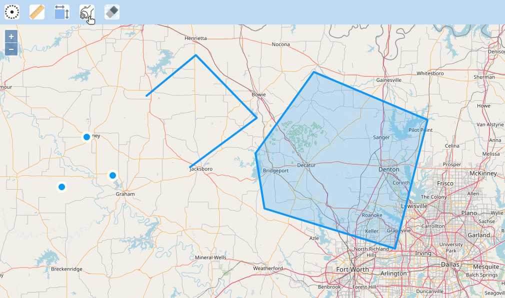

# OpenLayersModifyFeature
Modify vector features in OpenLayers

## For tutorial post, click on following link 
[Modify vector features in OpenLayers](https://spatial-dev.guru/2021/09/05/create-a-dynamicmeasurement-tool-in-openlayers-to-show-measurements-on-labels-that-follows-2/"")
